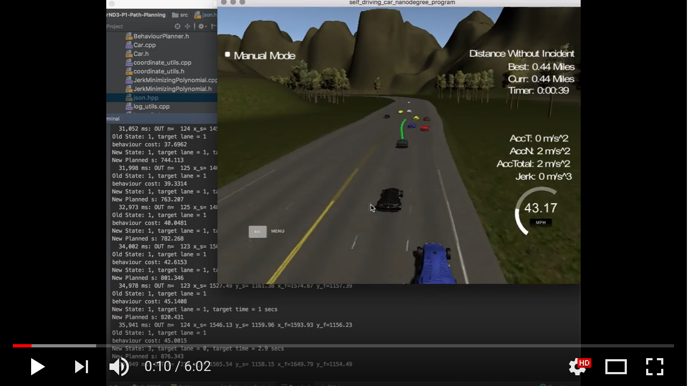

# Path Planning for Autonomous Vehicles
Udacity Self-Driving Car Engineer Nanodegree Program 
   
## Setting
This is a demo of path planning for autonomous vehicles for
highway driving. The driver program has to drive the car in simulator
around circular highway track. It is given waypoints but has to adapt
the speed/ to follow the track, avoid crashing to other vehicles
and plan 'comfortable' paths wihtin reasonable limits of acceleration
and jerk. 

It is given localisation data about the 
of the car and sensor fusion data about other vehicles
  
## Simulator
You can download the simulator from [here](https://github.com/udacity/self-driving-car-sim/releases)

## Goals
The goal is to safely navigate around a virtual highway 
with other traffic that is driving +-10 MPH of the 50 MPH speed limit. 

The driver program is provided with the car's localization and 
sensor fusion data, 
there is also a sparse list of waypoints to follow around the highway. 

The car should try to go as close as possible to the 50 MPH speed 
limit, which means passing slower traffic when possible.
Other cars will try to change lanes too. 
The car should avoid hitting other cars at all cost as well as 
driving inside of the marked road lanes at all times, unless 
going from one lane to another. 

The car should be able to make one complete loop around the 6946m 
highway. Since the car is trying to go 50 MPH, it should take a 
little over 5 minutes to complete 1 loop. 

Also the car should not experience total acceleration over 10 m/s^2 and jerk that is greater than 50 m/s^3.

The map of the highway is in `data/highway_map.txt`
Each waypoint in the list contains `[x,y,s,dx,dy]` values. 
`x` and `y` are the waypoint's map coordinate position, the `s` 
is [Frenet](https://en.wikipedia.org/wiki/Frenet%E2%80%93Serret_formulas) 
coordinate, the distance along the road to get to 
that waypoint in 
meters, the `dx` and `dy` values define the unit normal vector 
pointing outward of the highway loop.

The highway's waypoints loop around so the Frenet `s` value, 
distance along the road, goes from 0 to 6945.554.

# Build Instructions

1. Clone this repo.
2. Make a build directory: `mkdir build && cd build`
3. Compile: `cmake .. && make`
4. Run it: `./path_planning`


## Details

1. The car uses a perfect controller and will visit 
every (x,y) point it recieves in the list every .02 seconds. 
The units for the (x,y) points are in meters and the spacing of 
the points determines the speed of the car. 
The vector going from a point to the next point in the list 
dictates the angle of the car. 
Acceleration both in the tangential and normal directions is 
measured along with the jerk, the rate of change of total 
Acceleration. 
The (x,y) point paths that the planner recieves should not 
have a total acceleration that goes over 10 m/s^2, 
also the jerk should not go over 10 m/s^3. 

2. There will be some latency between the simulator running 
and the path planner returning a path. 
During this delay the simulator will continue using points that 
it was last given. `previous_path_x`, and `previous_path_y`
are passed from simulator and are the path points that the car has
not passed yet since last planning iteration.

3. A really helpful resource to smooth trajectories is 
[splines](http://kluge.in-chemnitz.de/opensource/spline/)


## Dependencies

* cmake >= 3.5
 * All OSes: [click here for installation instructions](https://cmake.org/install/)
* make >= 4.1
  * Linux: make is installed by default on most Linux distros
  * Mac: [install Xcode command line tools to get make](https://developer.apple.com/xcode/features/)
  * Windows: [Click here for installation instructions](http://gnuwin32.sourceforge.net/packages/make.htm)
* gcc/g++ >= 5.4
  * Linux: gcc / g++ is installed by default on most Linux distros
  * Mac: same deal as make - [install Xcode command line tools]((https://developer.apple.com/xcode/features/)
  * Windows: recommend using [MinGW](http://www.mingw.org/)
* [uWebSockets](https://github.com/uWebSockets/uWebSockets)
  * Run either `install-mac.sh` or `install-ubuntu.sh`.
  * If you install from source, checkout to commit `e94b6e1`, i.e.
    ```
    git clone https://github.com/uWebSockets/uWebSockets 
    cd uWebSockets
    git checkout e94b6e1
    ```

## Resulting Video

Here is an example video (speed up 4 times) of how the planner performs:

[](https://youtu.be/4v8bozDTjok)
